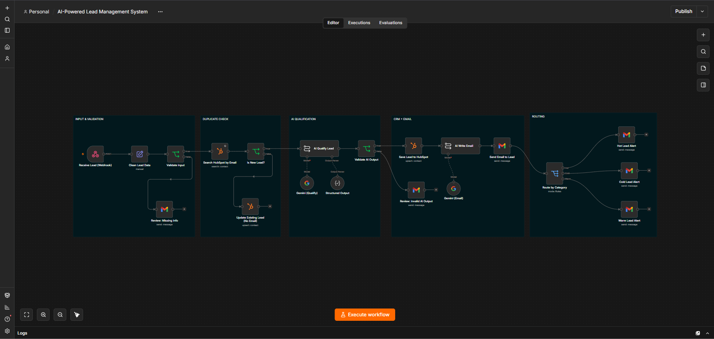

# Never Lose a Lead Again
### An AI lead-management system that captures, qualifies, and follows up on every lead, automatically.

## The problem
You get leads from your website, forms, or ads. Then:
- Someone replies 2 days late, and the lead has already gone elsewhere.
- The same person shows up 3 times in your CRM.
- Your sales team can't tell which leads are worth a call, so everyone gets the same slow treatment.
- Leads with missing or fake details waste your time.

## What this system does
Every new lead is handled in about a minute, with no manual work:

1. **Captures** the lead from any form or website (webhook).
2. **Checks quality**: missing name, email, budget, or requirement, or a badly formatted email, stops here and goes to a manual-review email. No junk in your CRM.
3. **Catches duplicates**: if the email already exists, the record is updated. No second contact, no second email.
4. **Scores the lead with AI** (0-100) and labels it **Hot / Warm / Cold**, with a one-line reason your team can read.
5. **Saves everything to HubSpot**: details, score, category, reason.
6. **Writes and sends a personalized email** using the lead's name, company, and actual requirement.
7. **Alerts your sales team** with a different message for Hot, Warm, and Cold leads.

**Result:** your team starts the day knowing exactly who to call first and why.

## Built to be trusted, not just to run
Most automations break on messy real-world input. This one was tested against it:

| Scenario | What happens |
|---|---|
| Brand-new lead | Full flow: CRM, email, alert |
| Same email submitted twice | One contact, one email |
| Missing email / budget / requirement | Stopped before the AI. Review email sent |
| Invalid email (`name@abc`) | Blocked by format check |
| AI returns a bad result (score 150, category "Very Hot") | Rejected. Sent to manual review |
| Requirement written in Hinglish | Scored correctly |
| Gibberish requirement | Not treated as high intent |
| Very high budget | Valid score, correct routing |

The AI output is **validated, not blindly trusted**. A model mistake never reaches your CRM or your customer.

## Real bugs found and fixed during testing
- An empty budget silently became `0` and passed validation. Fixed.
- An invalid email reached the CRM and caused an error. Fixed with a pre-check.
- Names were duplicated ("Rahul Sharma Sharma"). Fixed with first/last name splitting.

## Tech stack
n8n (workflow engine) | HubSpot CRM | Google Gemini | Gmail | Webhooks

Works with your existing tools. Google Sheets, Zoho, or another CRM can replace parts of the stack.

## What you get when we work together
- The workflow set up on **your** forms, your CRM, and your email
- AI scoring prompts tuned to **your** definition of a good lead
- Email tone matched to your brand
- Hosted setup, so it runs 24/7 without my laptop
- A short walkthrough so your team knows how to use it
- Support after launch (workflows need maintenance when tools change)

## How we start (low risk)
1. **Free 20-minute call**: you describe how leads are handled today.
2. **Pilot**: I build it for one lead source. You see it working on real leads.
3. **Roll out** to more sources if it's useful.

> Pricing: *[add your pilot price / setup fee here]*

## Honest notes
- This repo is a working demo. The production version runs on hosted infrastructure with a paid AI key, so there are no free-tier limits.
- In this demo, outgoing emails go to a test address. For live use they go to the lead, optionally after your approval.

## Contact
**Prakhar** | Data analytics + workflow automation
GitHub: github.com/prakhardotdev
LinkedIn: linkedin.com/in/prakhardotdev
Email: *[your business email]*
